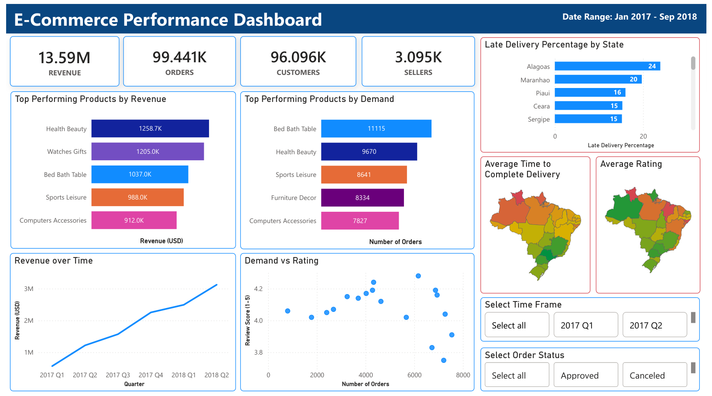

## Project Summary

An end-to-end analysis of the Olist Brazilian e-commerce marketplace **99K+ orders, 3K+ sellers, 33K+ products, and 1M+ geolocation records**, taken from raw CSV to business-ready insight.

**Pipeline:** cleaned and validated in **MySQL** → analyzed with **SQL** → visualized in **Power BI** → reported via **Microsoft Office**.

## Key Findings

- Late delivery is concentrated in Brazil's **North and Northeast** region. States with highest late delivery Percentages, **Alagoas (24%)** and **Maranhao (20%)**, are the most remote locations from the logistics hubs in Southeast region.
- The **carrier to customer** delivery leg drives most delays, not seller dispatch time.
- Revenue grew steadily **from 2017 Q1 to 2018 Q2**, fastest through late 2017, the exact window where average review scores began declining.
- Top revenue generating products: **"Health and Beauty", "Watches Gifts", "Bed Bath Table", "Sports Leisure" and "Computers Accessories"**
- Products with lowest customer review scores: **"Bed Bath Table", "Office Furniture", "Furniture Decor", "Computers Accessories" and "Watches Gifts"**

- Several top revenue generating products rank among the lowest in customer satisfaction: **"Bed Bath Table", "Computers Accessories" and "Watches Gifts"**
 

## Deliverables

| Resource | Description | Link |
|---|---|---|
| Interactive Dashboard | Power BI file (.pbix), connect to your own MySQL instance to explore | [Open](dashboard_and_report/Dashboard.pbix) |
| Dashboard (Static) | PDF export of the dashboard, no setup required | [Download](dashboard_and_report/Dashboard.pdf) |
| Executive Report | Business-facing summary of findings | [Download](dashboard_and_report/Executive_Report.pdf) |
| Technical Report | Full methodology, SQL logic, and data pipeline | [Download](dashboard_and_report/Technical_Report.pdf) |

---

## Dashboard Preview

KPIs (Revenue, Orders, Customers, Sellers), top performing product categories by revenue and demand, revenue trend over time, demand vs. rating distribution, a clickable "late delivery by state" ranking, two state maps (average delivery time, average rating), and Time Frame / Order Status filters.

Map legend

**Average Rating:** Green = highest, Red = lowest. 

**Average Time to Complete Delivery:**  Red = slowest, Green = fastest.

---

## Project Objectives

- Clean a real, imperfect public dataset the way a production **pipeline** would, including validate every transformation, avoid silent data loss, document every judgment call.
- Answer concrete **business questions** (regional delivery performance, seasonality, product category performance) directly in SQL.
- Present findings in two complementary formats (Interactive dashboard for exploration, and a report for a definitive, narrated answer to each business question).

---

## Project Roadmap

- **Phase 1 - Data Cleaning (MySQL)**
- **Phase 2 - Visualization & Presentation (Microsoft Power BI and Microsoft Office)**
  - SQL analysis - regional, seasonal, product category performance.
  - Power BI dashboard - KPIs, state maps, click to filter visuals, Time Frame and Order Status filters.
  - Project reports (PDF) - Executive Report and Technical Report.

---

## Tools Used

- MySQL Workbench 8.0 - Importing, Cleaning, Validation, Analysis
- Power BI - Dashboard (used import mode, read-only DB connection via user account with restricted privileges)
- Microsoft Office - Written report, referencing analysis findings

## Sources

- Kaggle Public Dataset: **Olist Brazilian E-Commerce Public Dataset**

- Dataset licensed under CC BY-NC-SA 4.0 (Olist, via Kaggle). 
- Did not redistributed in this repository and click below link to see Sources for the original.

- **Olist Brazilian E-Commerce Public Dataset** https://www.kaggle.com/datasets/olistbr/brazilian-ecommerce

---

## How to Run

1. Install MySQL Workbench 8.0+, enable local file loading: `SET GLOBAL local_infile = 1;`
2. Download the CSV files from the Kaggle link above and import the data to MySQL Workbench as new schema.
3. Run scripts in `/data_cleaning` folder, in the same order, via MySQL Workbench to clean the dataset.
4. Run the scripts in `/data_analysis` folder same as above to go through data analysis.
5. *(Optional)* Connect Power BI to the resulting schema to reproduce the dashboard (or view the files in the `/dashboard_and_report` folder, both **.pbix** and **.pdf** files are available).

  
🔍 <h4> Execution Order <h4>

##### Data Cleaning

1. Run the scripts in `./data_cleaning/` directory.

`Cleaning_01_Customers.sql`

`Cleaning_02_Geolocation.sql`

`Cleaning_03_Order_Items.sql`

`Cleaning_04_Order_Payments.sql`

`Cleaning_04_Order_Payments.sql`

`Cleaning_06_Orders.sql`

`Cleaning_07_Products.sql`

`Cleaning_08_Sellers.sql`

##### Data Analysis
2. Run the scripts in `./data_analysis/` directory.

`Analysis_01_Regional_Performance.sql`

`Analysis_02_Seasonality_Performance.sql`

`Analysis_03_Product_Category_Performance.sql`

---

# Technical Documentation

## Dataset

| Source CSV    | Raw Table   | Raw Rows  |
|-----------------------------------|-------------------------------|-----------|
| olist_customers_dataset.csv  | olist_customers_dataset  | 99,441 |
| olist_geolocation_dataset.csv  | olist_geolocation_dataset  | 1,000,163 |
| olist_order_items_dataset.csv  | olist_order_items_dataset  | 112,650 |
| olist_order_payments_dataset.csv  | olist_order_payments_dataset  | 103,886 |
| olist_order_reviews_dataset.csv | olist_order_reviews_dataset | 99,224 |
| olist_orders_dataset.csv  | olist_orders_dataset  | 99,441 |
| olist_products_dataset.csv  | olist_products_dataset  | 32,951 |
| olist_sellers_dataset.csv | olist_sellers_dataset | 3,095  |

Additional reference file: `product_category_name_translation.csv`

## Final Cleaned Tables

| Source CSV | Raw Table | Final Table | Primary Key | Initial Row Count | Final Row Count |
|---|---|---|---|---|---|
| olist_customers_dataset.csv | olist_customers_dataset | olist_customers_dataset_staging_1 | customer_id | 99,441 | 99,441 |
| olist_geolocation_dataset.csv | olist_geolocation_dataset | olist_geolocation_dataset_staging_2 | geolocation_zip_code_prefix | 1,000,163 | 19,015 |
| olist_order_items_dataset.csv | olist_order_items_dataset | olist_order_items_dataset_staging_2 | (order_id, order_item_id) | 112,650 | 112,650 |
| olist_order_payments_dataset.csv | olist_order_payments_dataset | olist_order_payments_dataset_staging_1 | (order_id, payment_sequential) | 103,886 | 103,886 |
| olist_order_reviews_dataset.csv | olist_order_reviews_dataset | olist_order_reviews_dataset_staging_2 | none - see Known Issues | 99,224 | 99,224 |
| olist_orders_dataset.csv | olist_orders_dataset | olist_orders_dataset_staging_1 | order_id | 99,441 | 99,441 |
| olist_products_dataset.csv | olist_products_dataset | olist_products_dataset_staging_2 | product_id | 32,951 | 32,951 |
| olist_sellers_dataset.csv | olist_sellers_dataset | olist_sellers_dataset_staging_1 | seller_id | 3,095 | 3,095 |

## Cleaning Operations Applied

| Operation  | Applied To      |
|--------------------------------|----------------------------------------------------------------------------------|
| TRIM (white space)  | All 8 tables       |
| NULLIF (empty string to NULL) | customers, order_items, order_payments, products, sellers   |
| VARCHAR to DATETIME   | order_items, order_reviews (2 columns), orders (6 columns)  |
| VARCHAR to INT  | order_items, order_payments     |
| drop Duplicates   | geolocation (981,148 rows removed; 1 row per zip_code_prefix; final: 19,015) |
| Category name translation  | products (Portuguese to English via LEFT JOIN)   |
| Row count validation  | All tables, every staging step (PASS/FAIL)    |
| Duplicate check  | All 8 tables       |
| Orphan check  | order_items, order_payments, order_reviews, orders    |
| Date sanity check  | orders (approval before purchase; delivery before purchase)   |
| Primary key   | All final tables except order_reviews    |

## Dashboard - Build Notes

- Connection: MySQL, read-only user, import mode (Did not used DirectQuery since this project only read data from the SQL server and never writes data in SQL server).
- Data Source for Power BI: Only import final staging tables in the schema.
- Display formatting applied in Power BI: `product_category_name_english` and city columns (Underscores replaced with spaces and capitalized first letter of each word).
- Analysis window: Jan 2017 - Sep 2018, matching the exclusions applied in `/data_analysis/Analysis_02_Seasonality_Performance.sql` (Read Executive Report for more information).
- Filters: Time Frame (Quarterly, 2017 Q1 - 2018 Q3), Order Status (all raw status values available), click to filter on the state map and the Late Delivery Percentage by State chart.
- Map legend

**Average Rating:** Green = highest, Red = lowest. 

**Average Time to Complete Delivery:**  Red = slowest, Green = fastest.

## Known Issues and Design Decisions

**1. No Primary Key in Order Reviews.** 

Two structural patterns exist between review_id and order_id: One review linked to multiple orders and one order linked to multiple reviews. Neither was dropped since the correct row to keep depends on downstream analysis context. This is resolved via `latest_review` CTE where needed.

**2. Did not standardized Geolocation city names.** 

~5,953 unique raw city name variants with misspellings and accent inconsistencies. This analysis does not cover any city level analysis. Therefore, Geolocation city names does not need cleaning.

**3. Geolocation deduplication is by zip_code_prefix only**.

Kept one row per zip code for 2 reasons. First, only state level analysis is conducted and in depth zip_code_prefix is unnecessary to achieve that objective. Second, zip_code_prefix and state is only geographic parameters utilized in this analysis. Two known state mislabels present in the raw data (AC where SP/RJ is correct) are not explicitly corrected before this dropping duplicates.

**4. Product dimensions - zero values flagged, not dropped.** since these columns are not needed for current analysis.

**5. VARCHAR column widths were set from expected ranges**, each value is validated against actual max string length in the source data via excel before importing.

**6. LOAD DATA Duplication safety:** Re-running `LOAD DATA LOCAL INFILE` without dropping relevant table caused silent duplicate appends. Fixed via `DROP TABLE IF EXISTS` before every `CREATE TABLE`.

## Prerequisites

- MySQL Workbench 8.0+
- Power BI Desktop (for dashboard file, optional)
- Microsoft Office (or any office suite alternative)

### Note

The script in `/extra` folder contains the original script I used to import data from CSV files to MySQL Workbench. I preferred local data load for 2 reasons. First, local data load is faster than default import Wizard. Second, this is the most efficient method for a small scale project. 

You must use `SET GLOBAL local_infile = 1;` in MySQL editor settings (Manage Server Connections > MySQL connections > Advanced > Other) to give permission to load data locally. This is ONLY relevant for local file loading method. Default "Data Import Wizard" or any other method does not need to change this permission.
